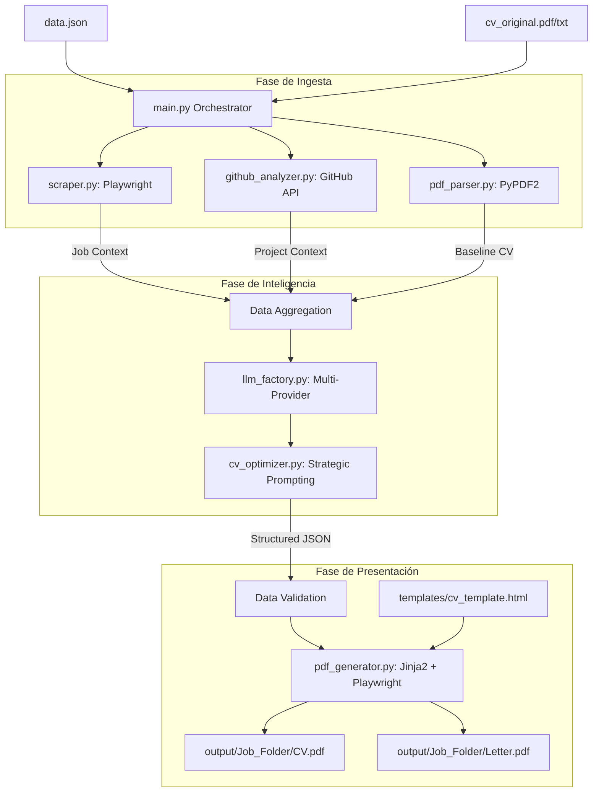

# Análisis de Arquitectura y Sostenibilidad: ATS-Master CV Pro

Este documento detalla el flujo de datos interno, la lógica de negocio y el camino para convertir este sistema en una herramienta empresarial escalable y mantenible.

---

## 1. Diagrama de Flujo del Proceso (Mermaid)

El siguiente diagrama muestra el camino que sigue la información desde la entrada del usuario hasta la generación de los archivos PDF finales.

---

## 2. Análisis de Módulos (Responsabilidades)

### `main.py` (Capa de Orquestación)
- **Responsabilidad**: Coordinar el orden de ejecución y gestionar la creación de carpetas de salida.
- **Flujo**: Lee configuración -> Llama a recolectores -> Llama a inteligencia -> Ejecuta rendering.

### `modules/scraper.py` (Capa de Ingesta Dinámica)
- **Responsabilidad**: Navegar por URLs complejas (LinkedIn, InfoJobs) y extraer el núcleo de la oferta.
- **Sostenibilidad**: Usa Playwright para manejar JS, pero depende de selectores CSS. Si las webs cambian, este módulo es el primero en romperse.
- **Mejora**: Implementar un sistema de "Selectores Genéricos" o usar un LLM-lite para limpiar el HTML bruto.

### `modules/llm_factory.py` (Capa de Abstracción de IA)
- **Responsabilidad**: Aislar la lógica de cada proveedor (Gemini, OpenAI, Anthropic).
- **Escalabilidad**: Implementa el patrón **Factory Method**. Añadir un nuevo modelo (ej. Llama 3) no requiere cambiar la lógica de optimización.

### `modules/cv_optimizer.py` (Capa de Lógica de Negocio)
- **Responsabilidad**: El "cerebro" del sistema. Realiza el **Strategic Repositioning** (Stack Pivoting).
- **Mantenibilidad**: Los prompts están embebidos en el código. Esto dificulta el ajuste fino por parte de no-desarrolladores.
- **Mejora**: Mover los prompts a archivos de texto externos o YAML.

### `modules/pdf_generator.py` (Capa de Presentación)
- **Responsabilidad**: Renderizar HTML/CSS a PDF de alta fidelidad.
- **Calidad**: Al usar Playwright/Chromium para imprimir, se asegura que el PDF sea 100% "digital-native" (ATS friendly).

---

## 3. Análisis de Escalabilidad y Sostenibilidad

### Cuellos de Botella Actuales
1.  **Latencia de Red**: El scraping dinámico puede tardar entre 5 y 15 segundos.
2.  **Consumo de Tokens**: Las ofertas largas y los READMEs extensos pueden consumir hasta 4,000-8,000 tokens por petición.
3.  **Dependencia de Estructura**: Si el LLM devuelve una respuesta que no es JSON puro, el script falla.

### Soluciones Propuestas para Largo Plazo

#### A. Centralización de Logs y Errores
- **Problema**: Los `print()` son difíciles de debugear en entornos de producción.
- **Solución**: Implementar el módulo `logging` de Python con rotación de archivos y niveles de error diferenciados.

#### B. Sistema de Prompts Desacoplados
- **Problema**: El ajuste del "Prompt Nivel Top" requiere editar código Python.
- **Solución**: Crear una carpeta `prompts/` con archivos `.md`. Permite versionar la "inteligencia" independientemente del "motor".

#### C. Inyección de Tipos (Type Hinting)
- **Problema**: Python es dinámico, lo que puede causar errores en tiempo de ejecución al manejar datos de la API.
- **Solución**: Añadir `Pydantic` para validar el JSON que viene del LLM antes de enviarlo al generador de PDF.

#### D. Caché de Ingesta
- **Problema**: Re-scrapear la misma oferta varias veces consume tiempo y tokens.
- **Solución**: Implementar una caché local (SQLite o JSON) con un hash de la URL. Si la oferta ya existe y tiene menos de 24h, se usa la versión local.

---

## 4. Conclusión Técnica
El código actual es **altamente modular**, lo cual es la base de la escalabilidad. La transición hacia una herramienta sostenible requiere ahora **robustez en los datos** (validación Pydantic) y **aislamiento de la inteligencia** (prompts externos). 

Este sistema está listo para escalar de "script personal" a un "microservicio de generación de CV".
