# Análisis de Arquitectura y Sostenibilidad: ATS-Master CV Pro (V5 Senior)

Este documento detalla el funcionamiento interno de bajo nivel, la lógica de validación y la infraestructura de caché que sostiene el Generador de CV.

---

## 1. Diagrama de Arquitectura Detallado (V5)

El siguiente diagrama muestra la interacción entre los nuevos módulos de validación y la persistencia de datos.

```mermaid
graph TD
    A[data.json] --> B[main.py Orchestrator]
    C[cv_original.pdf/txt] --> B
    
    subgraph "Capa de Ingesta & Caché"
        B --> D[scraper.py]
        D -->|URL Hash| CACHE[(.cache/job_cache.json)]
        CACHE -->|Miss| PW[Playwright Browser]
        PW -->|Scraped HTML| CACHE
        B --> E[github_analyzer.py: GitHub API]
        B --> F[pdf_parser.py: PyPDF2]
    end
    
    subgraph "Capa de Inteligencia & Validación"
        G[Context Aggregator] --> H[llm_factory.py]
        H --> I[cv_optimizer.py]
        P_DIR[[prompts/]] --> I
        I -->|Raw String| SAN[JSON Sanitization]
        SAN -->|Dict| PYD[models.py: Pydantic]
    end
    
    subgraph "Capa de Entrega"
        PYD -->|Verified Obj| K[pdf_generator.py]
        L[templates/cv_template.html] --> K
        K --> M[output/PDF_Final.pdf]
    end
```



---

## 2. Funcionamiento "Bajo el Capó" (Deep Dive)

### 2.1. Sistema de Caché Inteligente (`modules/scraper.py`)
Para evitar el re-scraping constante y el consumo innecesario de red, hemos implementado una caché persistente:
- **Hashing**: Usamos `hashlib.md5(url)` para generar una clave única de 32 caracteres por cada oferta. 
- **Persistencia**: Los datos se guardan en `.cache/job_cache.json`.
- **Lógica**: Si la clave existe en el JSON, el script devuelve los datos instantáneamente sin abrir el navegador. Esto es vital para el ahorro de tokens en la fase de testeo.

### 2.2. Validación Estricta de Datos (`modules/models.py`)
El mayor riesgo en aplicaciones que usan LLMs es el "formato impredecible" o alucinaciones estructurales.
- **Esquemas**: Definimos clases `BaseModel` de Pydantic para todas las entidades (CVData, Experience, Project, Education).
- **Control de Calidad**: Si el LLM omite un campo obligatorio o cambia un tipo de dato, Pydantic lanza una `ValidationError` detallada.
- **Sanitización**: `cv_optimizer.py` limpia automáticamente los tags ` ```json ` y espacios en blanco antes de parsear, asegurando que el JSON sea válido.

### 2.3. Desacoplamiento de Estrategia (`prompts/`)
La lógica de reclutamiento (el "cómo" se escribe el CV) se ha extraído totalmente del código fuente:
- **Carga Dinámica**: `CVOptimizer` lee archivos de texto externos en tiempo de ejecución.
- **Mantenibilidad**: Permite a un experto en reclutamiento ajustar la estrategia (keywords, tono, mirrorring) sin tocar una sola línea de código Python.

### 2.4. Fábrica de Proveedores (`modules/llm_factory.py`)
Hemos implementado un patrón **Static Factory**:
- **Abstracción**: El resto del código solo conoce el método `.generate()`. Esto permite intercambiar Gemini por GPT-4 o Claude 3 sin que el motor de optimización se entere.
- **Configuración**: La selección del modelo y los parámetros de temperatura están centralizados aquí.

---

## 3. Lógica de "Stack Pivoting" (Estrategia de Optimización)

El prompt externo (`prompts/cv_system_prompt.md`) implementa un algoritmo de **Mirroring Selectivo**:
1.  **Extracción de Intención**: Analiza la oferta para identificar el stack primario (ej. PHP/Laravel).
2.  **Repriorización**: Re-etiqueta experiencias "Backend Python" como "Desarrollo de APIs para integración Fullstack" si el rol lo requiere.
3.  **Inyección de Evidencia**: Escanea los READMEs reales de GitHub y selecciona aquellos que validan las habilidades técnicas pedidas.
4.  **Persona de Analista**: El sistema está instruido para elevar el perfil de "Developer" a "Analista Programador", enfocándose en el análisis de requisitos y diseño de soluciones.

---

## 4. Mejores Prácticas de Sostenibilidad

- **Type Hinting**: Todo el proyecto incorpora anotaciones de tipo de Python 3.10+ para mejorar el mantenimiento y el autocompletado en el IDE.
- **Modularidad**: Cada componente (Parser, Scraper, Optimizer) es independiente. Puedes cambiar PyPDF2 por otra librería de PDFs sin afectar al resto del sistema.
- **Seguridad**: Uso estricto de `.env` para evitar que las API Keys terminen en el repositorio de GitHub.

---

## 5. Conclusión de Ingeniería
Esta arquitectura V5 sitúa el proyecto en un nivel **Senior**. La combinación de validación de modelos, caché de red y desacoplamiento de inteligencia convierte lo que era un script de automatización en una **plataforma de generación de documentos robusta y escalable**.
